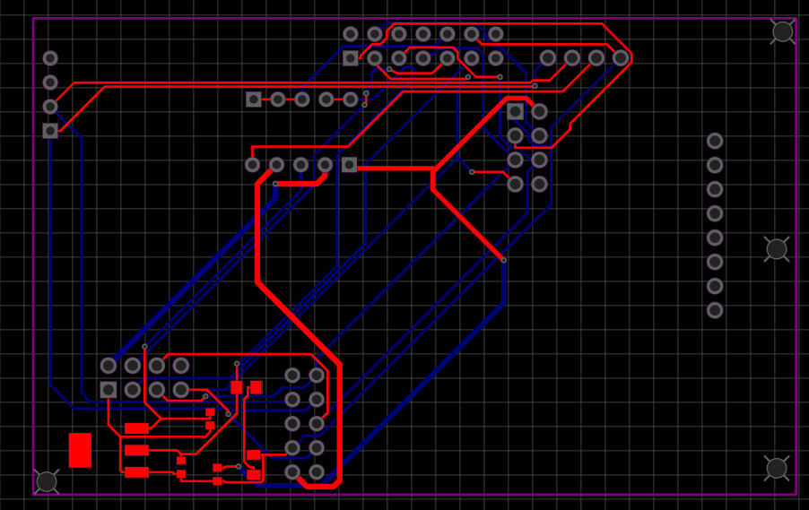

# cardputer-CP-rex

Custom PCB and housing design for the **M5Stack Cardputer ADV**.

This board enhances the capabilities of the M5Stack Cardputer for network auditing, RFID cloning, and monitoring 433 MHz / 2.4 GHz frequencies.

## Features
* **Network Auditing:** Advanced tools for testing Wi-Fi security.
* **RFID Support:** Capability to read and copy access keys.
* **Radio Monitoring:** Support for 433 MHz and 2.4 GHz bands.

## Hardware Requirements
To assemble this project, you will need:
* **Base:** M5Stack Cardputer ADV [Aliexpress](https://www.aliexpress.com/item/1005009896470580.html?spm=a2g0o.order_list.order_list_main.5.32bb1802YxDRel)
* **Capacitors:** 2x 50-100uF 0603, 1x 10uF 0603
* **Resistor:** 1x 1kΩ 0805
* **Stabilizer:** 1x AMS1117-3.3
* **LED:** 1x YL-ED0805YG
* **Switch:** 1x dip*5

## Modules
* **PN532**-rfid [Aliexpress](https://www.aliexpress.com/item/1005006288951025.html?spm=a2g0o.cart.0.0.202b38dasSFMRg&mp=1&pdp_npi=6%40dis%21UAH%21UAH%20180.35%21UAH%20172.69%21%21UAH%20172.69%21%21%21%40211b61ae17747349933717697e8784%2112000036625067447%21ct%21UA%214564123091%21%211%210%21)
* **cc1101**-433Mhz [Aliexpress](https://www.aliexpress.com/item/1005009890417155.html?spm=a2g0o.cart.0.0.202b38dasSFMRg&mp=1&pdp_npi=6%40dis%21UAH%21UAH%20233.08%21UAH%2095.09%21%21UAH%2095.09%21%21%21%40211b61ae17747349933717697e8784%2112000050491984925%21ct%21UA%214564123091%21%211%210%21)
* **nrf24**-2.4Ghz [Aliexpress](https://www.aliexpress.com/item/1005005482762019.html?spm=a2g0o.productlist.main.1.584424f10hTb87&algo_pvid=2fbcab80-47b2-4141-8b1d-debf448708a8&algo_exp_id=2fbcab80-47b2-4141-8b1d-debf448708a8-0&pdp_ext_f=%7B%22order%22%3A%22516%22%2C%22spu_best_type%22%3A%22price%22%2C%22eval%22%3A%221%22%2C%22fromPage%22%3A%22search%22%7D&pdp_npi=6%40dis%21UAH%2182.87%2182.87%21%21%211.72%211.72%21%40211b629217747350640176107e7e0a%2112000033261653881%21sea%21UA%214564123091%21X%211%210%21n_tag%3A-29919%3Bd%3Acde5765d%3Bm03_new_user%3A-29895&curPageLogUid=UzJHcjzzOZ75&utparam-url=scene%3Asearch%7Cquery_from%3A%7Cx_object_id%3A1005005482762019%7C_p_origin_prod%3A)
* **W5500**-LAN [Aliexpress](https://www.aliexpress.com/item/1005009737211405.html?spm=a2g0o.cart.0.0.202b38dasSFMRg&mp=1&pdp_npi=6%40dis%21UAH%21UAH%20202.15%21UAH%20202.15%21%21UAH%20202.15%21%21%21%40211b61ae17747349933717697e8784%2112000049996325331%21ct%21UA%214564123091%21%211%210%21)

## Board Layout

> **Current Status (v2.5)**
