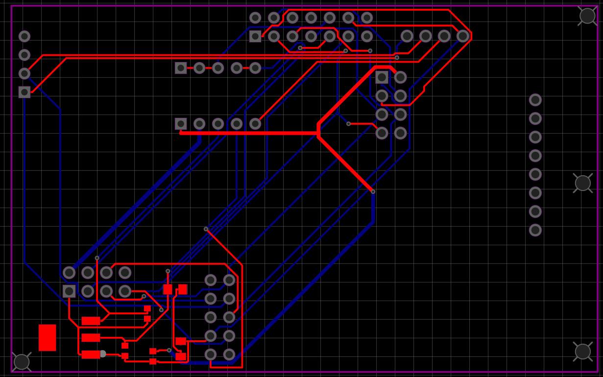

# cardputer-CP-rex
Printed circuit board and housing for the Advance M5Stack cardputer

This board's capabilities for the m5stack cardputer adv
include network auditing, copying RFID access keys, 
and viewing 433 MHz and 2.4 GHz networks.

This is version 2.2. We're now making the power tracks thicker, 
fixing short circuits, and bringing it to perfection.
